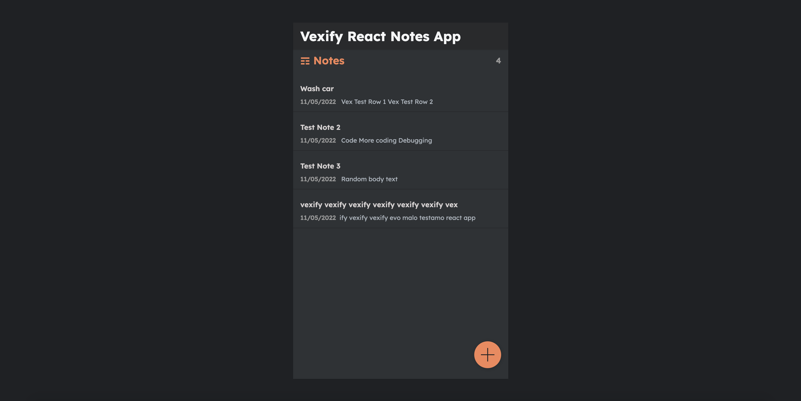
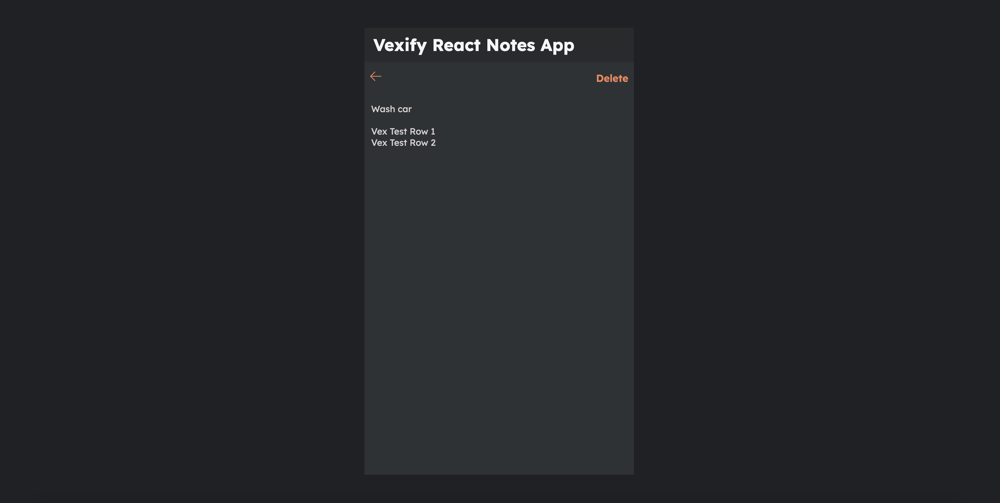

# Notes React Application

Notes application built using 'React' version 18.1.0. Application also uses 'React Router Dom' version 6.3.0. 

Mumble UI was used in the design and backend was built using 'json-server' version 0.17.0 which is a full fake REST API. Read more on this [docs link](https://www.npmjs.com/package/json-server/v/0.17.0).

<h2>Notes List Home Page</h2>

 

<h2>Single Note</h2>

 
